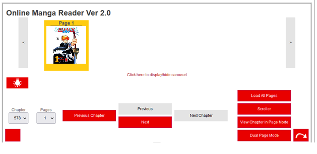

# OMAR - The Online MAnga Reader

This is an online manga reader built in Rust using Web Assembly (Yew).

**No manga provided**. Just the reader.


You can include it in your site, run it locally or do whatever you want. 


# Features (In Progress)

In 2010, I began a site called [innerbleach.com](http://web.archive.org/web/20140503061934/http://innerbleach.com/content/online-manga-reader-ver-20) (Which is now deceased). 



I built a manga reader that made the reading experience unique and pleasant. I also believed it was one of its kind, as it allowed you to:

- [x] Basic instantaneous manga reading (No Page loads)
- [ ] View thumbnails in a carousel while you were reading
- [ ] Prefetch the pages while you were reading.
- [ ] No loading between pages.
- [ ] View the manga side by side, creating a true reading experience.
- [ ] Save your progress and come back to where you left.
- [ ] Dim the background through a "turn off the lights"
- [ ] Automatically control the manga page by changing its width, and height to match your screen (so you could read it from a far), or very close.
- [ ] Read it from a TV and automatically scroll by a fixed timer (Cinema Mode). 
- [ ] View small thumbnails (Gallery Mode)
- [ ] Create a playlist. You could mash up One Piece, Bleach, Fairy Tail and Naruto into one batch reading (And supported all the features mentioned above)
- [ ] Customize the color of the buttons.

I'll try to create feature parity with it.

# Installation
1. Download and Install [Rust](https://www.rust-lang.org/).
2. Install Bonnie and Trunk
```sh
cargo install bonnie trunk
```
3. Run:
```
trunk serve
```

# How to add your manga.

Create the following structure:<br/>


1. Create a folder inside `src/assets` called `manga`.
2. Inside it, create a folder name called `one_piece`.
3. Then add the folder of the chapter in numbers: 
E.g: Chapter 1042 is `1042`. 

4. Add the pages inside the chapter's folder from 01 to last with the .jpg extension.
E.g:
```
01.jpg
02.jpg
...
19.jpg
```

When you run `trunk serve`, OMAR will automatically scan the folder `src/assets/one_piece` and count all the files and have it ready for you. 

### References
Bonnie:
https://github.com/arctic-hen7/bonnie/wiki/Getting-Started

https://dev.to/arctic_hen7/how-to-set-up-tailwind-css-with-yew-and-trunk-il9

### Notes
- The build.rs file is used to read the files from a directory and return it in a concrete rust file that will be used by yew to extract it.
- https://github.dev/brooks-builds/full-stack-todo-rust-course


### FAQ

#### Why Rust?
I want to learn the syntax, and it's a fun way to do so!

I did the same when I began learning JavaScript.

#### Will there be a JS version?
Who knows? 